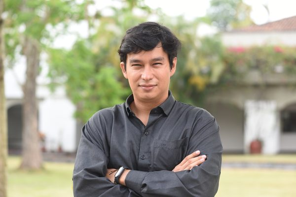
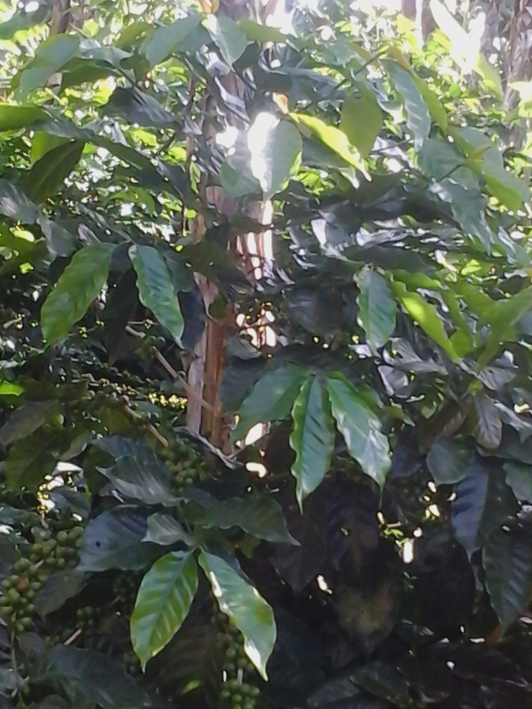
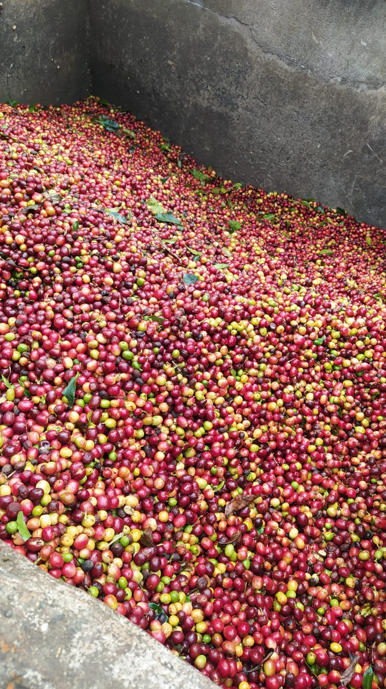
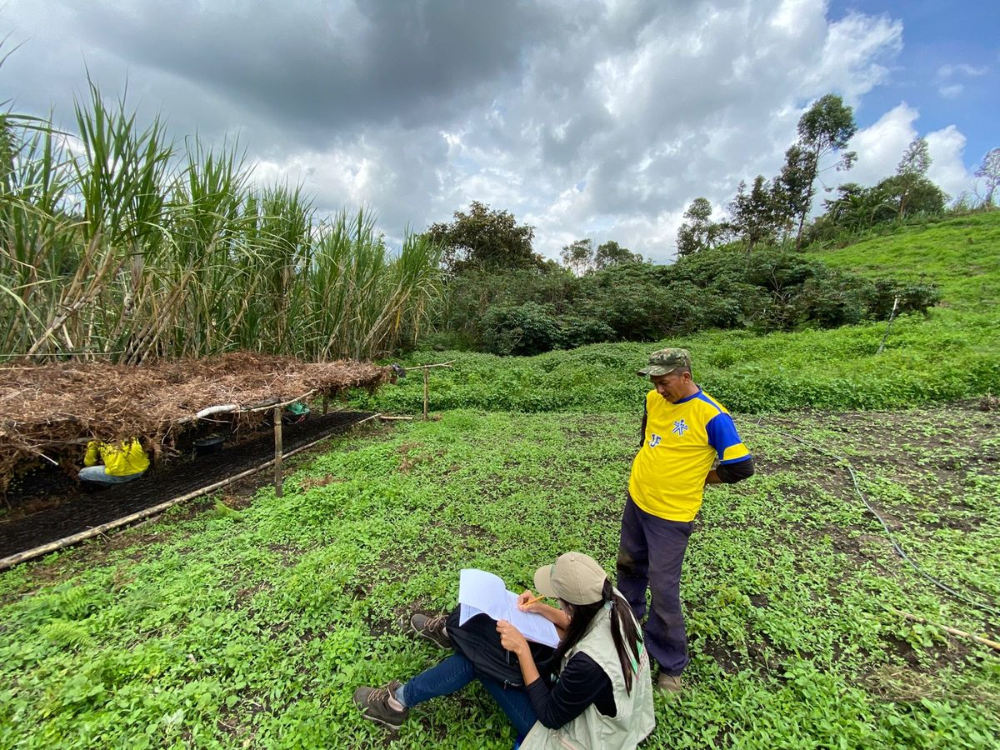
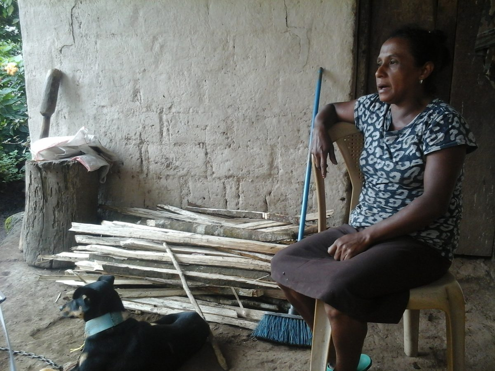
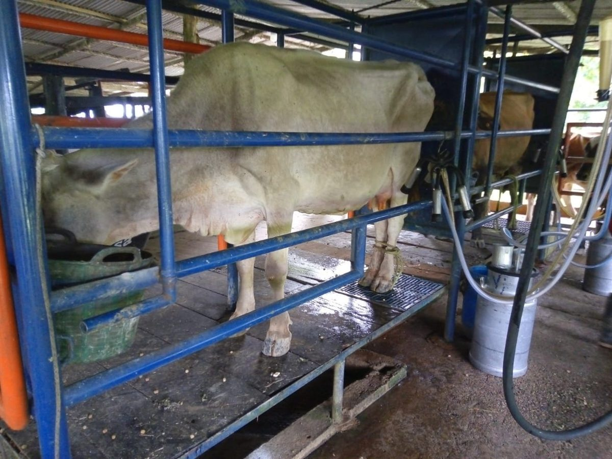
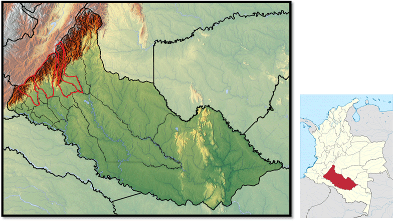

```{=html}
<!-- ===== HERO ===== -->
<section class="hero-eduard">
  <div class="hero-eduard-inner">

    <!-- LEFT: Name + meta + bio + icons -->
    <div class="hero-eduard-left">
      <h1 class="hero-eduard-name">Alexander Buriticá Casanova</h1>

      <div class="hero-eduard-meta">
        <p class="hero-eduard-role"><strong>PhD Economist · Postdoctoral Researcher</strong></p>
        <p class="hero-eduard-affiliation"><a href="https://alliancebioversityciat.org/" target="_blank">Alliance of Bioversity International and CIAT</a></p>
        <p class="hero-eduard-location"><i class="fa-solid fa-location-dot"></i> Cali, Colombia</p>
      </div>

      <div class="hero-eduard-bio">
        <p>
          I study when access to agricultural technology actually improves farmers' lives. My work applies impact evaluation and causal inference to sustainable agriculture, food security, and post-conflict rural development — from silvopastoral systems in the Colombian Amazon to community seed banks in Ethiopia.
        </p>
      </div>

      <div class="hero-eduard-icons">
        <a href="mailto:a.buritica@cgiar.org" title="Email"><i class="fa-solid fa-envelope"></i></a>
        <a href="https://scholar.google.com/citations?hl=es&user=43WzRV4AAAAJ&view_op=list_works&sortby=pubdate" target="_blank" title="Google Scholar"><i class="ai ai-google-scholar"></i></a>
        <a href="https://github.com/AlexanderBuritica" target="_blank" title="GitHub"><i class="fa-brands fa-github"></i></a>
        <a href="https://www.linkedin.com/in/alexander-buritica-casanova-738827155/" target="_blank" title="LinkedIn"><i class="fa-brands fa-linkedin"></i></a>
        <a href="https://orcid.org/0000-0002-3856-9126" target="_blank" title="ORCID"><i class="ai ai-orcid"></i></a>
      </div>
    </div>

    <!-- RIGHT: Photo + actions -->
    <div class="hero-eduard-right">
      
      <a href="files/cv_ingles_v3.pdf" class="cv-btn" target="_blank"><i class="fa-solid fa-file-pdf"></i> Download CV</a>
      <a href="https://scholar.google.com/citations?hl=es&user=43WzRV4AAAAJ&view_op=list_works&sortby=pubdate" target="_blank" class="gs-badge"><i class="ai ai-google-scholar"></i> 374 citations · h-index 5</a>
    </div>

  </div>
</section>

<!-- ===== FIELDWORK STRIP ===== -->
<div class="fw-strip">
  <a href="speakers.html" class="fw-strip-item"></a>
  <a href="speakers.html" class="fw-strip-item"></a>
  <a href="speakers.html" class="fw-strip-item"></a>
  <a href="speakers.html" class="fw-strip-item"></a>
  <a href="speakers.html" class="fw-strip-item"></a>
  <div class="fw-strip-label"><span>Fieldwork</span></div>
</div>

<hr class="section-divider">

<!-- ===== EDUCATION ===== -->
<section class="home-section">
  <h2>Education</h2>
  <div class="cv-list">

    <div class="cv-item">
      <div class="cv-logo"></div>
      <div class="cv-body">
        <strong>PhD in Economics</strong> <span class="cv-date">(2016–2023)</span><br>
        Universidad de los Andes, Colombia
      </div>
    </div>

    <div class="cv-item">
      <div class="cv-logo"></div>
      <div class="cv-body">
        <strong>MSc in Economics</strong> <span class="cv-date">(2016–2023)</span><br>
        Universidad de los Andes, Colombia
      </div>
    </div>

    <div class="cv-item">
      <div class="cv-logo"></div>
      <div class="cv-body">
        <strong>BSc in Economics</strong> <span class="cv-date">(2007–2013)</span><br>
        Universidad del Valle, Colombia
      </div>
    </div>

  </div>
</section>

<hr class="section-divider">

<!-- ===== EXPERIENCE ===== -->
<section class="home-section">
  <h2>Experience</h2>
  <div class="cv-list">

    <div class="cv-item">
      <div class="cv-logo"></div>
      <div class="cv-body">
        <strong>Postdoctoral Fellow</strong> <span class="cv-date">(2023–Present)</span><br>
        Alliance of Bioversity International & CIAT (CGIAR)
      </div>
    </div>

    <div class="cv-item">
      <div class="cv-logo"></div>
      <div class="cv-body">
        <strong>Senior Research Associate</strong> <span class="cv-date">(2022–2023)</span><br>
        Alliance of Bioversity International & CIAT (CGIAR)
      </div>
    </div>

    <div class="cv-item">
      <div class="cv-logo"></div>
      <div class="cv-body">
        <strong>Development Economics Specialist</strong> <span class="cv-date">(2021–2022)</span><br>
        Vérité · Amherst, USA
      </div>
    </div>

    <div class="cv-item">
      <div class="cv-logo"></div>
      <div class="cv-body">
        <strong>Visiting Researcher</strong> <span class="cv-date">(2019–2021)</span><br>
        CIAT · Palmira, Colombia
      </div>
    </div>

    <div class="cv-item">
      <div class="cv-logo"></div>
      <div class="cv-body">
        <strong>Research Assistant</strong> <span class="cv-date">(2013–2016)</span><br>
        CIAT · Palmira, Colombia
      </div>
    </div>

  </div>
</section>

<hr class="section-divider">

<!-- ===== AWARDS ===== -->
<section class="home-section">
  <h2>Awards & Fellowships</h2>
  <div class="cv-list">

    <div class="cv-item">
      <div class="cv-logo"></div>
      <div class="cv-body">
        <strong>ICO Award for Excellence in Coffee Research</strong> <span class="cv-date">(2019)</span><br>
        International Coffee Organization
      </div>
    </div>

    <div class="cv-item">
      <div class="cv-logo"></div>
      <div class="cv-body">
        <strong>COLCIENCIAS Doctoral Scholarship</strong> <span class="cv-date">(2017–2020)</span><br>
        Minciencias, Colombia
      </div>
    </div>

  </div>
</section>

<hr class="section-divider">

<!-- ===== SELECTED PUBLICATIONS ===== -->
<section class="home-section">
  <h2>Selected Publications</h2>

  <div class="selected-papers">

    <a href="https://doi.org/10.1080/23311932.2026.2651483" target="_blank" class="feat-card">
      <span class="feat-new">NEW</span><span class="feat-year">2026</span>
      <div class="feat-img"></div>
      <div class="feat-body">
        <div class="feat-title">Technology access without impact? An evaluation of Ecuador's input subsidy program for rice</div>
        <div class="feat-journal"><em>Cogent Food &amp; Agriculture</em>, 2026</div>
      </div>
    </a>

    <a href="https://www.ecologyandsociety.org/vol31/iss2/art1/" target="_blank" class="feat-card">
      <span class="feat-new">NEW</span><span class="feat-year">2026</span>
      <div class="feat-img"></div>
      <div class="feat-body">
        <div class="feat-title">Using landscape approaches to understand peacebuilding policy coherence: a case study of Caquetá</div>
        <div class="feat-journal"><em>Ecology and Society</em>, 2026</div>
      </div>
    </a>

    <a href="https://doi.org/10.1007/s10640-025-01011-y" target="_blank" class="feat-card">
      <span class="feat-year">2025</span>
      <div class="feat-img"></div>
      <div class="feat-body">
        <div class="feat-title">Sweating bullets: Heat, high-stakes evaluations, and the role of incentives</div>
        <div class="feat-journal"><em>Environmental and Resource Economics</em>, 2025</div>
      </div>
    </a>

  </div>

  <p class="selected-more">
    See all <a href="publications.html">publications & working papers</a> · <a href="news2.html">news & highlights</a>
  </p>
</section>
```
