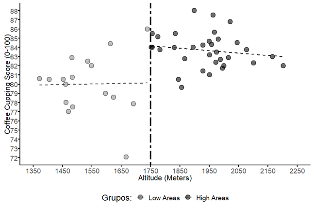
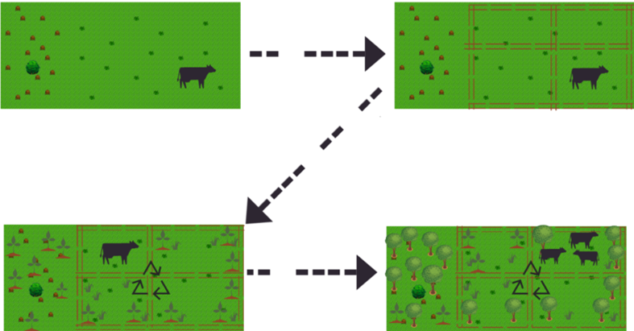
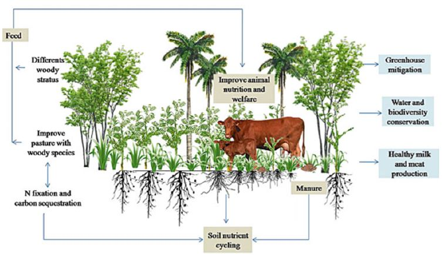
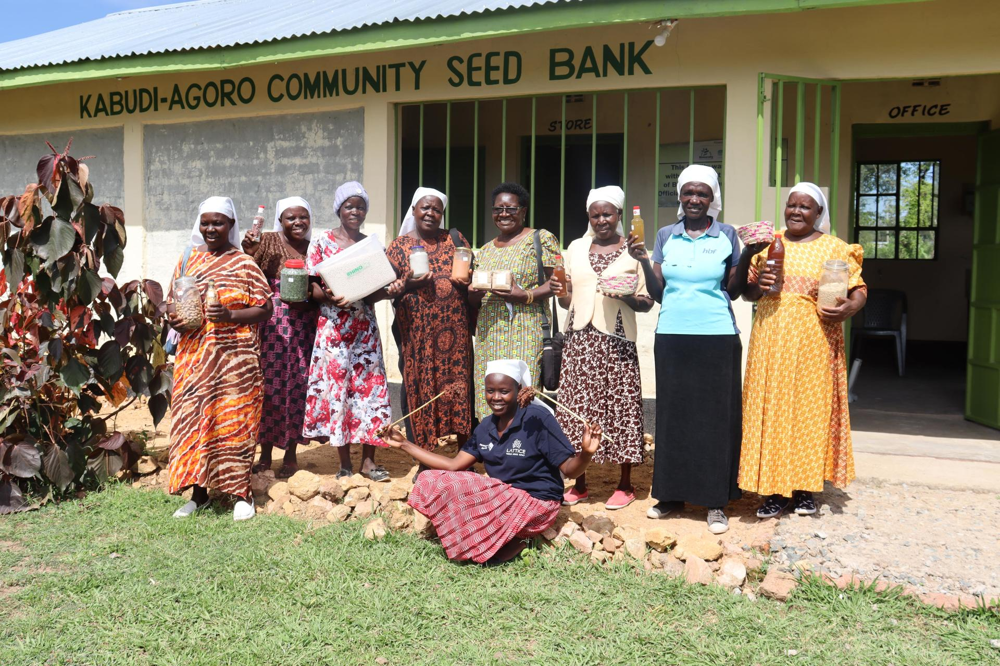
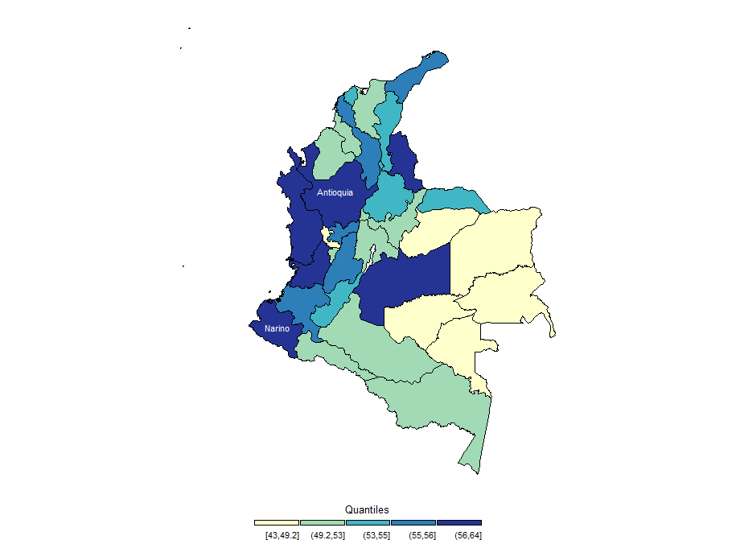
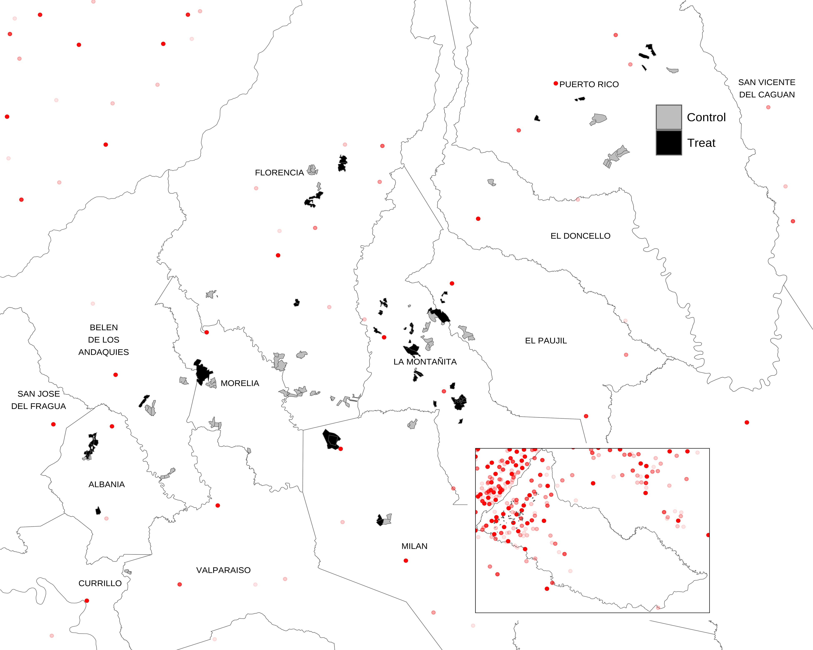

<!--Include academic icons or buttons-->



```{=html}
<p class="pub-intro">
  This section presents my peer-reviewed publications. Additional information, PDFs, and data repositories are linked when available. Click <strong>ABS</strong> to view the abstract.
</p>

<hr class="pub-divider">

<!-- ==================== 2026 ==================== -->
<h2 class="pub-year-heading">2026</h2>

<div class="pub-card">
  <div class="pub-card-img">
    
  </div>
  <div class="pub-card-body">
    <div class="pub-card-title">Coffee cupping as a quality signal: Impacts on smallholder prices and market access in Colombia</div>
    <div class="pub-card-authors"><strong>Alexander Buriticá Casanova</strong>, Carolina González</div>
    <div class="pub-card-journal"><em>Journal of Agribusiness in Developing and Emerging Economies</em>, pp. 1–24, 2026</div>
    <div class="pub-card-links">
      <button class="pub-btn pub-abs-toggle" onclick="toggleAbstract(this)">ABS</button>
      <a href="https://www.emerald.com/jadee/article-abstract/doi/10.1108/JADEE-05-2025-0217" target="_blank" class="pub-btn">Journal</a>
    </div>
    <div class="pub-abstract">
      This paper examines the role of coffee cupping protocols as quality signals in Colombian specialty coffee markets. Using data from smallholder producers, we evaluate whether participation in cupping—a standardized sensory evaluation—translates into higher farmgate prices and improved market access. Results indicate that cupping scores serve as an effective signaling mechanism, generating significant price premiums for producers who participate. However, barriers to participation—including geographic isolation, limited technical capacity, and costs of quality certification—disproportionately exclude the smallest producers, raising concerns about equity in quality-driven value chains.
    </div>
  </div>
</div>

<div class="pub-card">
  <div class="pub-card-img">
    
  </div>
  <div class="pub-card-body">
    <div class="pub-card-title">Food security and forest access in the Colombian and Peruvian Amazon</div>
    <div class="pub-card-authors"><strong>Alexander Buriticá</strong>, Martha Vanegas, Andres Espada, Mary Ngaiwi, Deborah Pierce, Marcela Quintero</div>
    <div class="pub-card-journal"><em>Food Security</em>, 2026. Springer</div>
    <div class="pub-card-links">
      <button class="pub-btn pub-abs-toggle" onclick="toggleAbstract(this)">ABS</button>
            <a href="https://link.springer.com/article/10.1007/s12571-025-01639-0" target="_blank" class="pub-btn">Journal</a>
    </div>
    <div class="pub-abstract">
      This study investigates the relationship between forest access and food security in indigenous and non-indigenous communities of the Colombian and Peruvian Amazon. Using household-level survey data and dietary diversity indicators, we find that forest quality and ethnic group membership are significant determinants of food security outcomes. Communities with better forest access exhibit higher dietary diversity, and indigenous households rely more heavily on forest-based food sources. The findings underscore the importance of integrating forest conservation into food security strategies in Amazonian contexts.
    </div>
  </div>
</div>

<div class="pub-card">
  <div class="pub-card-img">
    
  </div>
  <div class="pub-card-body">
    <div class="pub-card-title">Advancing sustainable silvopastoral practices for achieving zero deforestation in the Colombian Amazon</div>
    <div class="pub-card-authors"><strong>Alexander Buriticá</strong>, Mary Ngaiwi, Manuel Moreno, Carolina González, Augusto Castro-Nunez</div>
    <div class="pub-card-journal"><em>Agricultural Systems</em>, vol. 231, 104525, 2026</div>
    <div class="pub-card-links">
      <button class="pub-btn pub-abs-toggle" onclick="toggleAbstract(this)">ABS</button>
      <a href="https://doi.org/10.1016/j.agsy.2025.104525" target="_blank" class="pub-btn">DOI</a>
      <a href="https://www.sciencedirect.com/science/article/abs/pii/S0308521X25002653" target="_blank" class="pub-btn">Journal</a>
    </div>
    <div class="pub-abstract">
      This paper evaluates the adoption and effectiveness of silvopastoral practices as a strategy for achieving zero deforestation in the Colombian Amazon. Using farm-level data from Caquetá, we assess whether silvopastoral systems reduce deforestation pressure while maintaining or improving livestock productivity. Results show that adopters of silvopastoral practices exhibit significantly lower rates of forest clearing and higher milk yields per hectare, suggesting that sustainable intensification can be compatible with conservation goals in frontier regions.
    </div>
  </div>
</div>

<div class="pub-card">
  <div class="pub-card-img">
    
  </div>
  <div class="pub-card-body">
    <div class="pub-card-title">Using landscape approaches to understand peacebuilding policy coherence: a case study of Caquetá, Colombia</div>
    <div class="pub-card-authors">Deborah A. Pierce, Sara E. Collazos Acosta, Fanny Howland, <strong>Alexander Buriticá Casanova</strong>, Augusto Castro-Nunez</div>
    <div class="pub-card-journal"><em>Ecology and Society</em>, vol. 31(2):1, 2026</div>
    <div class="pub-card-links">
      <button class="pub-btn pub-abs-toggle" onclick="toggleAbstract(this)">ABS</button>
      <a href="https://www.ecologyandsociety.org/vol31/iss2/art1/" target="_blank" class="pub-btn">Journal</a>
    </div>
    <div class="pub-abstract">
      We analyzed policy coherence within the Colombian Integrated Rural Reform (Reforma Rural Integral; RRI) peacebuilding policy, using landscape approaches (LAs). Landscape approaches link agricultural practices, institutions, and policies, providing an effective conceptual framework for coherence in policy objectives, instruments, and implementation for effective landscape governance. We empirically examined coherence across and within the RRI, as well as the extent to which the RRI is consistent with LAs. We analyzed the programs with a focus on territorial development (PDETs), and the RRI's implementation mechanism in four municipalities in the Department of Caquetá, Colombia. The study identified incoherence within PDET initiatives and problem and vision statements, specifically regarding land initiatives, although stronger coherence was noted between the RRI and PDET vision statements. Our findings show that the current peacebuilding policy instruments in Colombia fall short of being consistent with LAs, especially in principles concerned with participation and rights in implementation.
    </div>
  </div>
</div>

<hr class="pub-divider">

<!-- ==================== 2025 ==================== -->
<h2 class="pub-year-heading">2025</h2>

<div class="pub-card">
  <div class="pub-card-img">
    
  </div>
  <div class="pub-card-body">
    <div class="pub-card-title">Sweating bullets: Heat, high-stakes evaluations, and the role of incentives</div>
    <div class="pub-card-authors">Jose Maria Martinez, Victor Zuluaga, <strong>Alexander Buriticá</strong></div>
    <div class="pub-card-journal"><em>Environmental and Resource Economics</em>, vol. 88(9), pp. 2429–2467, 2025</div>
    <div class="pub-card-links">
      <button class="pub-btn pub-abs-toggle" onclick="toggleAbstract(this)">ABS</button>
      <a href="https://doi.org/10.1007/s10640-025-01011-y" target="_blank" class="pub-btn">Journal</a>
    </div>
    <div class="pub-abstract">
      This paper examines the causal effect of heat exposure on performance in high-stakes evaluations. Using administrative data from national standardized exams in Colombia and exogenous temperature variation, we estimate significant negative effects of heat on test scores. We further explore whether financial incentives can mitigate the cognitive costs of heat exposure, finding heterogeneous effects across socioeconomic groups. The results have implications for climate adaptation policies in education and for understanding the broader welfare costs of rising temperatures.
    </div>
  </div>
</div>

<hr class="pub-divider">

<!-- ==================== 2024 ==================== -->
<h2 class="pub-year-heading">2024</h2>

<div class="pub-card">
  <div class="pub-card-img">
    
  </div>
  <div class="pub-card-body">
    <div class="pub-card-title">Unlocking sustainable livestock production potential in the Colombian Amazon through paddock division and gender inclusivity</div>
    <div class="pub-card-authors">Augusto Castro-Nunez, <strong>Alexander Buriticá</strong>, Federico Holmann, Mary Ngaiwi, Marcela Quintero, Antonio Solarte, Carolina González</div>
    <div class="pub-card-journal"><em>Scientific Reports</em>, vol. 14(1), 13644, 2024</div>
    <div class="pub-card-links">
      <button class="pub-btn pub-abs-toggle" onclick="toggleAbstract(this)">ABS</button>
      <a href="https://doi.org/10.1038/s41598-024-63697-2" target="_blank" class="pub-btn">Journal</a>
    </div>
    <div class="pub-abstract">
      This study evaluates the impact of paddock division and gender-inclusive training programs on livestock productivity and sustainability in the Colombian Amazon. Using data from a randomized intervention in Caquetá, we find that paddock division significantly increases milk production per hectare while reducing land degradation. Farms with women's active participation in management decisions show additional productivity gains, highlighting the role of gender inclusivity in sustainable agricultural intensification.
    </div>
  </div>
</div>

<hr class="pub-divider">

<!-- ==================== 2021 ==================== -->
<h2 class="pub-year-heading">2021</h2>

<div class="pub-card">
  <div class="pub-card-img">
    
  </div>
  <div class="pub-card-body">
    <div class="pub-card-title">The risk of unintended deforestation from scaling sustainable livestock production systems</div>
    <div class="pub-card-authors">Augusto Castro-Nunez, <strong>Alexander Buriticá</strong>, Carolina González, Eliza Villarino, Federico Holmann, et al.</div>
    <div class="pub-card-journal"><em>Conservation Science and Practice</em>, vol. 3(9), e495, 2021</div>
    <div class="pub-card-links">
      <button class="pub-btn pub-abs-toggle" onclick="toggleAbstract(this)">ABS</button>
      <a href="https://conbio.onlinelibrary.wiley.com/doi/full/10.1111/csp2.495" target="_blank" class="pub-btn">Journal</a>
    </div>
    <div class="pub-abstract">
      Scaling sustainable livestock production systems is widely promoted as a strategy to reduce deforestation. However, productivity gains may also incentivize herd expansion and land clearing. This paper assesses the risk of unintended deforestation from scaling silvopastoral and improved pasture systems in the Colombian Amazon. Using spatially explicit data and scenario analysis, we identify conditions under which intensification leads to rebound effects, and discuss policy safeguards to ensure that productivity gains translate into genuine conservation outcomes.
    </div>
  </div>
</div>

<hr class="pub-divider">

<!-- ==================== 2017 ==================== -->
<h2 class="pub-year-heading">2017</h2>

<div class="pub-card">
  <div class="pub-card-img">
    
  </div>
  <div class="pub-card-body">
    <div class="pub-card-title">Land-related grievances shape tropical forest cover in areas affected by armed conflict</div>
    <div class="pub-card-authors">Augusto Castro-Nunez, Ole Mertz, <strong>Alexander Buriticá</strong>, Chrystian C. Sosa, Stephanie T. Lee</div>
    <div class="pub-card-journal"><em>Applied Geography</em>, vol. 85, pp. 39–50, 2017</div>
    <div class="pub-card-links">
      <button class="pub-btn pub-abs-toggle" onclick="toggleAbstract(this)">ABS</button>
      <a href="https://www.sciencedirect.com/science/article/abs/pii/S0143622817301662" target="_blank" class="pub-btn">Journal</a>
    </div>
    <div class="pub-abstract">
      This paper examines how land-related grievances associated with armed conflict influence tropical forest cover in Colombia. Using spatial econometric methods and panel data from conflict-affected municipalities, we find that areas with higher incidences of land dispossession and forced displacement experienced greater deforestation. The results highlight the importance of addressing land tenure grievances as part of integrated strategies for peacebuilding and environmental conservation in post-conflict settings.
    </div>
  </div>
</div>

<div class="pub-card">
  <div class="pub-card-img">
    
  </div>
  <div class="pub-card-body">
    <div class="pub-card-title">Identifying socioeconomic characteristics defining consumers' acceptance for main organoleptic attributes of an iron-biofortified bean variety in Guatemala</div>
    <div class="pub-card-authors">Salomón Pérez, <strong>Alexander Buriticá</strong>, Adewale Oparinde, Ekin Birol, Carolina González, Manfred Zeller</div>
    <div class="pub-card-journal"><em>International Journal on Food System Dynamics</em>, vol. 8(3), pp. 222–235, 2017</div>
    <div class="pub-card-links">
      <button class="pub-btn pub-abs-toggle" onclick="toggleAbstract(this)">ABS</button>
      <a href="https://brill.com/view/journals/fsd/8/3/article-p222_4.xml" target="_blank" class="pub-btn">Journal</a>
    </div>
    <div class="pub-abstract">
      This paper identifies the socioeconomic characteristics that influence consumers' acceptance of key organoleptic attributes (taste, texture, color, and cooking time) of an iron-biofortified bean variety in Guatemala. Using discrete choice experiments and multinomial logit models, we find that household income, education, and prior familiarity with bean varieties significantly predict willingness to accept biofortified alternatives. The findings provide actionable insights for targeting and marketing strategies aimed at improving micronutrient intake through biofortification programs.
    </div>
  </div>
</div>

<hr class="pub-divider">

<!-- ==================== 2016 ==================== -->
<h2 class="pub-year-heading">2016</h2>

<div class="pub-card">
  <div class="pub-card-img">
    
  </div>
  <div class="pub-card-body">
    <div class="pub-card-title">Gestión ambiental y gobernanza en los municipios del Valle del Cauca</div>
    <div class="pub-card-authors"><strong>Alexander Buriticá-Casanova</strong>, Fabio Arias-Arbelaez</div>
    <div class="pub-card-journal"><em>Ambiente y Sostenibilidad</em>, vol. 5, pp. 78–96, 2016</div>
    <div class="pub-card-links">
      <button class="pub-btn pub-abs-toggle" onclick="toggleAbstract(this)">ABS</button>
      <a href="https://revistaambiente.univalle.edu.co/index.php/ays/article/view/4304/6524" target="_blank" class="pub-btn">Journal</a>
    </div>
    <div class="pub-abstract">
      Este artículo analiza la gestión ambiental y la gobernanza en los municipios del Valle del Cauca, Colombia. Se evalúa la capacidad institucional de los gobiernos locales para implementar políticas ambientales y se identifican los factores que determinan la efectividad de la gestión ambiental municipal. Los resultados muestran una heterogeneidad significativa en las capacidades institucionales, con municipios más pequeños enfrentando mayores restricciones presupuestales y técnicas para cumplir con sus obligaciones ambientales.
    </div>
  </div>
</div>

<hr class="pub-divider">

<!-- ==================== 2015 ==================== -->
<h2 class="pub-year-heading">2015</h2>

<div class="pub-card">
  <div class="pub-card-img">
    
  </div>
  <div class="pub-card-body">
    <div class="pub-card-title">The effect of specialty coffee certification on household livelihood strategies and specialisation</div>
    <div class="pub-card-authors">Wytse Vellema, <strong>Alexander Buriticá Casanova</strong>, Carolina González, Marijke D'Haese</div>
    <div class="pub-card-journal"><em>Food Policy</em>, vol. 57, pp. 13–25, 2015</div>
    <div class="pub-card-links">
      <button class="pub-btn pub-abs-toggle" onclick="toggleAbstract(this)">ABS</button>
      <a href="https://www.sciencedirect.com/science/article/pii/S0306919215000810" target="_blank" class="pub-btn">Journal</a>
    </div>
    <div class="pub-abstract">
      This paper examines the effect of specialty coffee certification on household livelihood strategies and agricultural specialisation among smallholder coffee producers in Colombia. Using survey data and propensity score matching, we find that certified households exhibit higher levels of coffee specialisation and derive a larger share of income from coffee production. However, certification does not uniformly improve overall household welfare, suggesting that the benefits of certification are mediated by market access conditions and household-level characteristics.
    </div>
  </div>
</div>

<hr class="pub-divider">

<!-- ==================== WORKING PAPERS ==================== -->
<h2 class="pub-year-heading" id="working-papers">Working Papers</h2>

<div class="pub-card">
  <div class="pub-card-img">
    
  </div>
  <div class="pub-card-body">
    <div class="pub-card-title">Silvopastoral systems in practice: Evidence from a dairy value chain intervention in Caquetá, Colombia</div>
    <div class="pub-card-authors"><strong>Alexander Buriticá</strong></div>
    <div class="pub-card-journal"><em>Working Paper</em></div>
    <div class="pub-card-links">
      <a href="https://scholar.google.com/citations?view_op=view_citation&hl=es&user=43WzRV4AAAAJ&sortby=pubdate&citation_for_view=43WzRV4AAAAJ:RGFaLdJalmkC" target="_blank" class="pub-btn">Scholar</a>
    </div>
  </div>
</div>

<div class="pub-card">
  <div class="pub-card-img">
    
  </div>
  <div class="pub-card-body">
    <div class="pub-card-title">Impacts of Community Seed Banks on seed security and food access outcomes in Ethiopia: A multinomial logit analysis</div>
    <div class="pub-card-authors">Mary Eyeniyeh Ngaiwi, <strong>Alexander Buriticá</strong>, Carolina González, Dejene Kassahun Mengistu, Eric Junior Bomdzele, Elisabetta Gotor, Augusto Castro-Nunez</div>
    <div class="pub-card-journal"><em>Working Paper</em></div>
    <div class="pub-card-links">
      <a href="https://scholar.google.com/citations?view_op=view_citation&hl=es&user=43WzRV4AAAAJ&sortby=pubdate&citation_for_view=43WzRV4AAAAJ:BqipwSGYUEgC" target="_blank" class="pub-btn">Scholar</a>
    </div>
  </div>
</div>

<div class="pub-card">
  <div class="pub-card-img">
    
  </div>
  <div class="pub-card-body">
    <div class="pub-card-title">Gendered dynamics in Colombian public policy: Assessing impact and investment towards equitable development</div>
    <div class="pub-card-authors"><strong>Alexander Buriticá</strong>, Diana Carolina Lopera, Maria Blanco, Jorge Rueda, Fanny Howland</div>
    <div class="pub-card-journal"><em>Working Paper</em></div>
    <div class="pub-card-links">
      <a href="https://scholar.google.com/citations?view_op=view_citation&hl=es&user=43WzRV4AAAAJ&sortby=pubdate&citation_for_view=43WzRV4AAAAJ:hC7cP41nSMkC" target="_blank" class="pub-btn">Scholar</a>
    </div>
  </div>
</div>

<div class="pub-card">
  <div class="pub-card-img">
    
  </div>
  <div class="pub-card-body">
    <div class="pub-card-title">A case study of the FARC peace agreement impact on land markets in Caquetá, Colombia</div>
    <div class="pub-card-authors">Manuel Moreno, <strong>Alexander Buriticá</strong>, Carolina González, Augusto Castro</div>
    <div class="pub-card-journal"><em>Working Paper</em></div>
    <div class="pub-card-links">
      <a href="https://scholar.google.com/citations?view_op=view_citation&hl=es&user=43WzRV4AAAAJ&sortby=pubdate&citation_for_view=43WzRV4AAAAJ:hFOr9nPyWt4C" target="_blank" class="pub-btn">Scholar</a>
      <a href="https://cgspace.cgiar.org/items/e6e0703a-886b-4108-80c0-a9cc8f770a57" target="_blank" class="pub-btn">Slides</a>
    </div>
  </div>
</div>

<!-- ===== TOGGLE SCRIPT ===== -->
<script>
function toggleAbstract(btn) {
  const abstract = btn.closest('.pub-card-body').querySelector('.pub-abstract');
  if (abstract) {
    const isOpen = abstract.classList.contains('pub-abstract-open');
    abstract.classList.toggle('pub-abstract-open');
    btn.classList.toggle('pub-btn-active');
  }
}
</script>
```
