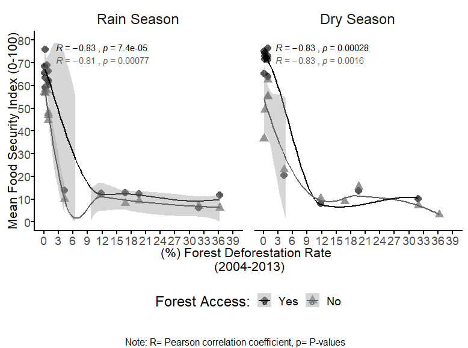

<!--Include academic icons or buttons-->



# Working Papers

::: wp-list
-   [**Silvopastoral Systems in Practice: Evidence from a Dairy Value Chain Intervention in Caquetá, Colombia**](https://scholar.google.com/citations?view_op=view_citation&hl=es&user=43WzRV4AAAAJ&sortby=pubdate&citation_for_view=43WzRV4AAAAJ:RGFaLdJalmkC)

    {.wp-figure}

    [<strong>Alexander Buritica</strong>]{.wp-authors}

------------------------------------------------------------------------

-   [**Impacts of Community Seed Banks on Seed Security and Food Access Outcomes in Ethiopia: A Multinomial Logit Analysis**](https://scholar.google.com/citations?view_op=view_citation&hl=es&user=43WzRV4AAAAJ&sortby=pubdate&citation_for_view=43WzRV4AAAAJ:BqipwSGYUEgC)

    {.wp-figure width="914"}

    [Mary Eyeniyeh Ngaiwi; <strong>Alexander Buritica</strong>; Carolina Gonzalez;\
    Dejene Kassahun Mengistu; Eric Junior Bomdzele; Elisabetta Gotor;\
    Augusto Carlos Castro-Nunez]{.wp-authors}

------------------------------------------------------------------------

-   [**Gendered dynamics in Colombian public policy: Assessing impact and investment towards equitable development**](https://scholar.google.com/citations?view_op=view_citation&hl=es&user=43WzRV4AAAAJ&sortby=pubdate&citation_for_view=43WzRV4AAAAJ:hC7cP41nSMkC)

    {.wp-figure}

    [<strong>Alexander Buritica</strong>; Diana Carolina Lopera; Maria Blanco;\
    Jorge Rueda; Fanny Howland]{.wp-authors}

------------------------------------------------------------------------

-   [**A case study of the FARC peace agreement impact on land markets in Caquetá, Colombia**](https://scholar.google.com/citations?view_op=view_citation&hl=es&user=43WzRV4AAAAJ&sortby=pubdate&citation_for_view=43WzRV4AAAAJ:hFOr9nPyWt4C)

    {width="898"}

    [Manuel Moreno; <strong>Alexander Buritica</strong>;\
    Carolina Gonzalez; Augusto Castro]{.wp-authors}

    [[Slides](https://cgspace.cgiar.org/items/e6e0703a-886b-4108-80c0-a9cc8f770a57){.wp-btn}]{.wp-links}

------------------------------------------------------------------------

-   [**Food security and forest access in the Colombian and Peruvian Amazon: How do forest quality and belonging to an ethnic group play a role?**](https://scholar.google.com/citations?view_op=view_citation&hl=es&user=43WzRV4AAAAJ&sortby=pubdate&citation_for_view=43WzRV4AAAAJ:dhFuZR0502QC)

    {.wp-figure}

    [<strong>Alexander Buritica</strong>; Martha Vanegas; Deborah Pierce;\
    Marcela Quintero]{.wp-authors}

    [[Slides](https://cgspace.cgiar.org/items/acb864d8-0b9f-42fb-b84f-79450ef573b2){.wp-btn}]{.wp-links}
:::
