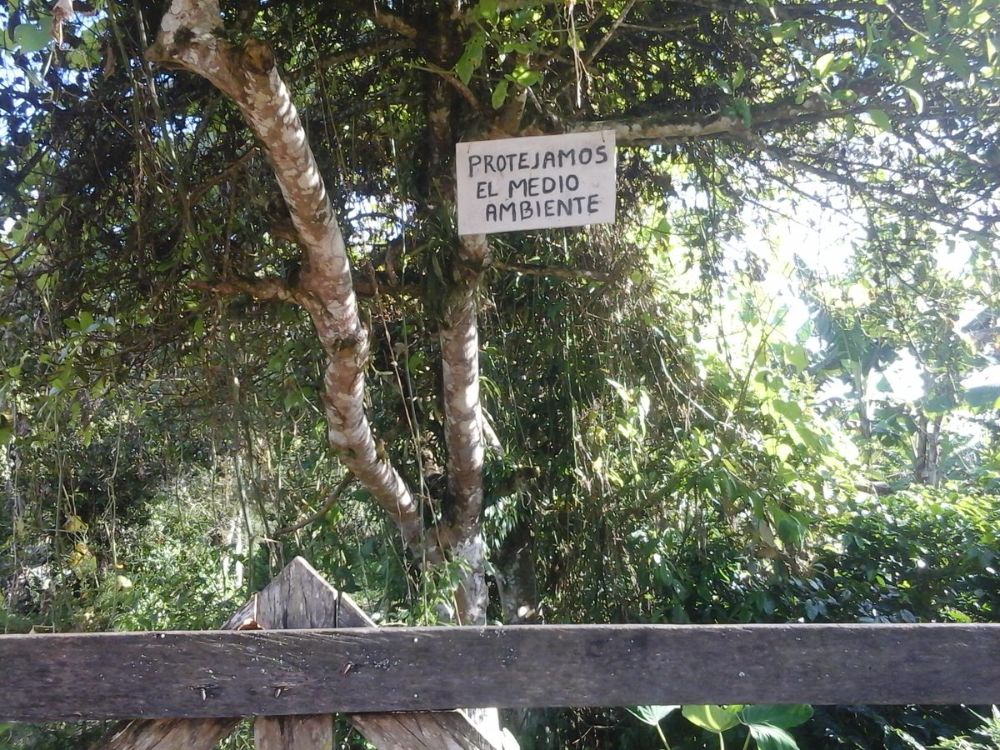
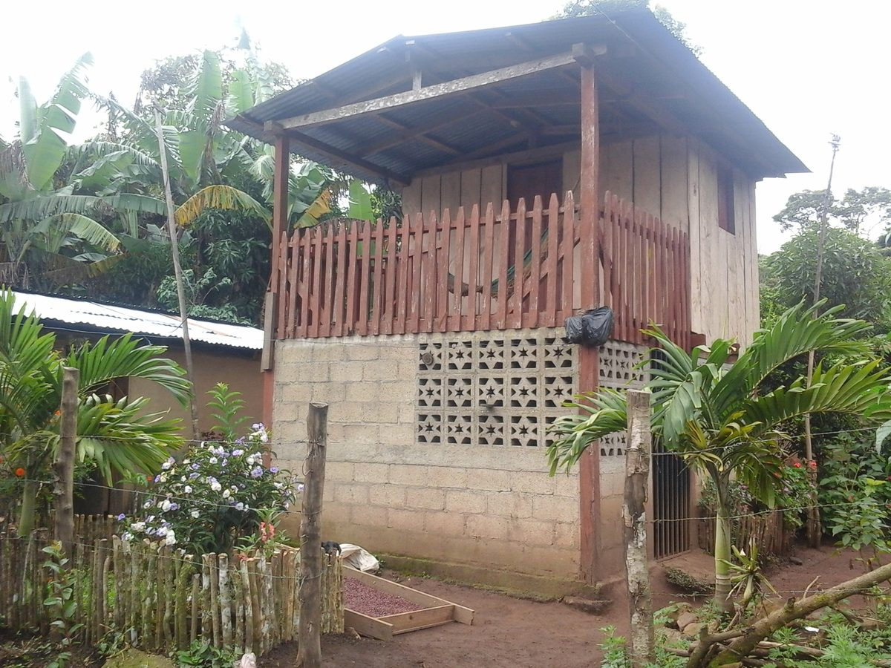

```{=html}
<section class="research-page">
  <h1 class="research-page-title">Research</h1>

  <div class="rc-statement">
    <div class="rc-lead">I study when access to agricultural technology actually improves farmers' lives — and when it doesn't.</div>
    <p>
      I am an applied economist working at the intersection of <em>technology adoption</em>, <em>impact evaluation</em>, and <em>rural development</em>. My work traces the gap between technology access and lasting welfare gains across smallholder systems in Latin America and Sub-Saharan Africa, and identifies the design features that make agricultural and environmental policy more effective and equitable. I received my PhD in Economics from Universidad de los Andes, Bogotá.
    </p>
    <div class="rc-methods"><b>Methods:</b> difference-in-differences · propensity score matching · event-study designs · instrumental variables · randomized controlled trials</div>
  </div>

  <div class="rc-areas">

    <div class="rc-area">
      <div class="rc-anum">01</div>
      <div class="rc-area-body">
        <h3>Technology Adoption &amp; Agricultural Productivity</h3>
        <p>Why do some farmers adopt improved technologies while others do not, and when does adoption translate into productivity gains? I study the determinants and impacts of adoption in smallholder systems — input subsidies, silvopastoral systems, and improved variety diffusion in Colombia and Ecuador.</p>
        <div class="rc-tags">
          <a href="https://doi.org/10.1080/23311932.2026.2651483" target="_blank" class="rc-tag">Cogent Food &amp; Agric. 2026</a>
          <a href="https://doi.org/10.1016/j.agsy.2025.104525" target="_blank" class="rc-tag">Agric. Systems 2026</a>
          <a href="https://doi.org/10.1038/s41598-024-63697-2" target="_blank" class="rc-tag">Scientific Reports 2024</a>
        </div>
      </div>
    </div>

    <div class="rc-area">
      <div class="rc-anum">02</div>
      <div class="rc-area-body">
        <h3>Impact Evaluation &amp; Program Design</h3>
        <p>I evaluate the causal effects of agricultural and environmental programs using state-of-the-art econometric methods, with a cross-cutting concern for whether program targeting and design reach the most constrained populations.</p>
        <div class="rc-tags">
          <a href="https://doi.org/10.1007/s10640-025-01011-y" target="_blank" class="rc-tag">Env. &amp; Resource Econ. 2025</a>
          <a href="https://doi.org/10.1108/JADEE-05-2025-0217" target="_blank" class="rc-tag">JADEE 2026</a>
          <a href="https://conbio.onlinelibrary.wiley.com/doi/full/10.1111/csp2.495" target="_blank" class="rc-tag">Cons. Sci. &amp; Practice 2021</a>
        </div>
      </div>
    </div>

    <div class="rc-area">
      <div class="rc-anum">03</div>
      <div class="rc-area-body">
        <h3>Food Security &amp; Rural Livelihoods</h3>
        <p>What determines food security in remote, forest-dependent communities? I study how forest access, ethnic group membership, and value chain mechanisms — from coffee cupping to community seed banks — shape dietary diversity, farmgate prices, and livelihood strategies.</p>
        <div class="rc-tags">
          <a href="https://link.springer.com/article/10.1007/s12571-025-01639-0" target="_blank" class="rc-tag">Food Security 2026</a>
          <a href="https://doi.org/10.1016/j.nerpsj.2026.100049" target="_blank" class="rc-tag">Peace &amp; Sustainability 2026</a>
          <a href="https://www.sciencedirect.com/science/article/pii/S0306919215000810" target="_blank" class="rc-tag">Food Policy 2015</a>
        </div>
      </div>
    </div>

    <div class="rc-area">
      <div class="rc-anum">04</div>
      <div class="rc-area-body">
        <h3>Policy Coherence, Gender &amp; Post-Conflict Governance</h3>
        <p>Do post-conflict policies designed to transform rural landscapes deliver coherent, equitable outcomes for women? I analyze policy coherence within Colombia's peacebuilding framework and how gender and intersectionality mediate land restitution outcomes.</p>
        <div class="rc-tags">
          <a href="https://www.ecologyandsociety.org/vol31/iss2/art1/" target="_blank" class="rc-tag">Ecology &amp; Society 2026</a>
          <a href="https://doi.org/10.1016/j.jrurstud.2026.104167" target="_blank" class="rc-tag">J. Rural Studies 2026</a>
          <a href="https://www.sciencedirect.com/science/article/abs/pii/S0143622817301662" target="_blank" class="rc-tag">Applied Geography 2017</a>
        </div>
      </div>
    </div>

  </div>

  <!-- ═══ FIELDWORK GALLERY ═══ -->
  <div class="fw-section">
    <h2 class="ra-section-heading">In the Field</h2>
    <p class="fw-intro">My research is grounded in primary data collection across Latin America. Below are highlights from fieldwork in Colombia and Ecuador.</p>
    <div class="fw-grid">
      <div class="fw-photo"><span>Data collection, Colombia</span></div>
      <div class="fw-photo"><span>Coffee value chains</span></div>
      <div class="fw-photo"><span>Farm visits, Caquetá</span></div>
      <div class="fw-photo"><span>Household surveys</span></div>
      <div class="fw-photo"><span>Smallholder systems</span></div>
      <div class="fw-photo"><span>Forest &amp; conservation</span></div>
    </div>
    <p class="fw-more"><a href="speakers.html">View full fieldwork gallery →</a></p>
  </div>

</section>
```
