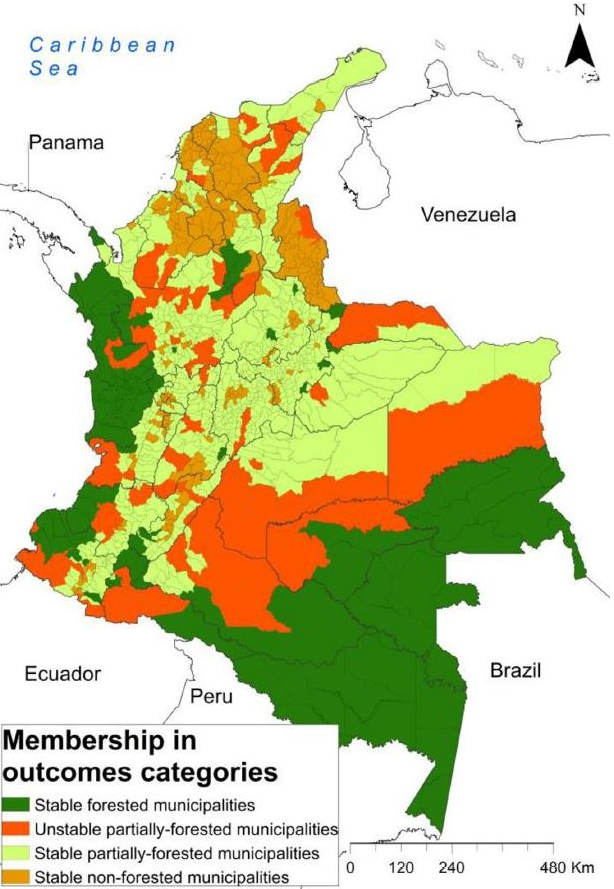

```{=html}
<section class="research-page">
  <h1 class="research-page-title">Research</h1>

  <div class="research-statement">
    <p>
      I am an applied economist working at the intersection of technology adoption, agricultural development, and impact evaluation. My research agenda examines how smallholder farmers adopt new technologies and practices, what constrains or facilitates that process, and whether public interventions designed to accelerate adoption actually deliver productivity and welfare gains. I study these questions using quasi-experimental and experimental methods—including difference-in-differences, propensity score matching, event-study designs, instrumental variables, and randomized controlled trials—applied to household and farm-level data from Latin America and Sub-Saharan Africa.
    </p>
    <p>
      A central theme in my work is the gap between technology access and technology impact. Input subsidy programs, value chain interventions, and extension services often succeed in increasing adoption rates, yet the translation of adoption into sustained productivity improvements depends critically on complementary factors: credit access, institutional support, market integration, and the targeting of heterogeneous farming populations. My research documents these gaps and identifies design features that make agricultural policies more effective and equitable.
    </p>
    <p>
      A second line of inquiry focuses on the environmental and food security dimensions of agricultural systems. I evaluate whether sustainable intensification strategies—such as silvopastoral systems and zero-deforestation agreements—can reconcile productivity growth with conservation goals in frontier landscapes. I also study how forest access, ethnic group membership, and value chain mechanisms shape food security and livelihood outcomes in remote communities.
    </p>
    <p>
      More recently, I have engaged with questions of policy coherence in post-conflict settings, examining whether the cross-sectoral design of Colombia's peacebuilding framework translates into coherent implementation at the territorial level, and how gender and intersectionality shape the outcomes of land restitution programs.
    </p>
    <p>
      I have published in <em>Agricultural Systems</em>, <em>Environmental and Resource Economics</em>, <em>Ecology and Society</em>, <em>Journal of Rural Studies</em>, <em>Food Security</em>, <em>Scientific Reports</em>, <em>Cogent Food &amp; Agriculture</em>, <em>Food Policy</em>, and <em>Applied Geography</em>, among others. I received my PhD in Economics from Universidad de los Andes, Bogotá.
    </p>
  </div>

  <h2 class="ra-section-heading">Research Areas</h2>

  <!-- ═══ Area 1 ═══ -->
  <div class="ra-card">
    <div class="ra-visual">
      
    </div>
    <div class="ra-body">
      <span class="ra-label"><i class="fa-solid fa-seedling"></i> Research Area</span>
      <h2>Technology Adoption &amp; Agricultural Productivity</h2>
      <p>
        Why do some farmers adopt improved technologies while others do not, and when does adoption translate into actual productivity gains? I study the determinants and impacts of technology adoption in smallholder farming systems, with attention to the heterogeneous effects across farm sizes, credit constraints, and institutional environments. Recent work evaluates input subsidy programs, silvopastoral system adoption, and improved variety diffusion in Colombia and Ecuador, documenting how program design features interact with structural barriers to shape adoption outcomes.
      </p>
      <div class="ra-papers">
        <span class="ra-papers-label">Key papers:</span>
        <a href="https://doi.org/10.1080/23311932.2026.2651483" target="_blank">Ecuador's input subsidy for rice (Cogent Food &amp; Agric., 2026)</a>
        <a href="https://doi.org/10.1016/j.agsy.2025.104525" target="_blank">Silvopastoral &amp; zero deforestation (Agric. Systems, 2026)</a>
        <a href="https://doi.org/10.1038/s41598-024-63697-2" target="_blank">Sustainable livestock production (Scientific Reports, 2024)</a>
      </div>
    </div>
  </div>

  <!-- ═══ Area 2 ═══ -->
  <div class="ra-card ra-card-reverse">
    <div class="ra-visual">
      
    </div>
    <div class="ra-body">
      <span class="ra-label"><i class="fa-solid fa-chart-line"></i> Research Area</span>
      <h2>Impact Evaluation &amp; Program Design</h2>
      <p>
        I evaluate the causal effects of agricultural and environmental programs on farmer outcomes, using state-of-the-art econometric methods. This includes multi-country evaluations of Climate Information Services and Climate-Smart Agriculture interventions across six Sub-Saharan African countries, as well as research on how environmental shocks—such as extreme heat during high-stakes evaluations—affect human capital formation. A cross-cutting concern is how program targeting and design determine whether interventions reach and benefit the most constrained populations.
      </p>
      <div class="ra-papers">
        <span class="ra-papers-label">Key papers:</span>
        <a href="https://doi.org/10.1007/s10640-025-01011-y" target="_blank">Heat &amp; high-stakes evaluations (Env. &amp; Resource Econ., 2025)</a>
        <a href="https://doi.org/10.1108/JADEE-05-2025-0217" target="_blank">Coffee quality signals &amp; market access (JADEE, 2026)</a>
        <a href="https://conbio.onlinelibrary.wiley.com/doi/full/10.1111/csp2.495" target="_blank">Unintended deforestation effects (Cons. Sci. &amp; Practice, 2021)</a>
      </div>
    </div>
  </div>

  <!-- ═══ Area 3 ═══ -->
  <div class="ra-card">
    <div class="ra-visual">
      
    </div>
    <div class="ra-body">
      <span class="ra-label"><i class="fa-solid fa-bowl-food"></i> Research Area</span>
      <h2>Food Security &amp; Rural Livelihoods</h2>
      <p>
        What determines food security in remote, forest-dependent communities, and how do value chain interventions affect smallholder welfare? I study the relationship between forest access, ethnic group membership, and dietary diversity in indigenous and non-indigenous households of the Colombian and Peruvian Amazon. I also investigate how market mechanisms—such as coffee cupping protocols and specialty certifications—shape farmgate prices, market access, and livelihood strategies for smallholder producers.
      </p>
      <div class="ra-papers">
        <span class="ra-papers-label">Key papers:</span>
        <a href="https://link.springer.com/article/10.1007/s12571-025-01639-0" target="_blank">Food security &amp; forest access (Food Security, 2026)</a>
        <a href="https://www.sciencedirect.com/science/article/pii/S0306919215000810" target="_blank">Coffee certification &amp; livelihoods (Food Policy, 2015)</a>
      </div>
    </div>
  </div>

  <!-- ═══ Area 4 ═══ -->
  <div class="ra-card ra-card-reverse">
    <div class="ra-visual">
      
    </div>
    <div class="ra-body">
      <span class="ra-label"><i class="fa-solid fa-scale-balanced"></i> Research Area</span>
      <h2>Policy Coherence, Gender &amp; Post-Conflict Governance</h2>
      <p>
        How coherent are post-conflict policies designed to transform rural landscapes, and do they deliver equitable outcomes for women? I analyze policy coherence within Colombia's Integrated Rural Reform peacebuilding framework using landscape approaches, and examine how gender and intersectionality mediate the outcomes of land restitution programs. This work connects institutional design to on-the-ground implementation, documenting where cross-sectoral policy instruments succeed or fail in conflict-affected territories.
      </p>
      <div class="ra-papers">
        <span class="ra-papers-label">Key papers:</span>
        <a href="https://www.ecologyandsociety.org/vol31/iss2/art1/" target="_blank">Landscape approaches &amp; peacebuilding (Ecology &amp; Society, 2026)</a>
        <a href="https://doi.org/10.1016/j.jrurstud.2026.104167" target="_blank">Gender &amp; land restitution (J. Rural Studies, 2026)</a>
        <a href="https://www.sciencedirect.com/science/article/abs/pii/S0143622817301662" target="_blank">Land grievances &amp; forest cover (Applied Geography, 2017)</a>
      </div>
    </div>
  </div>

</section>
```
